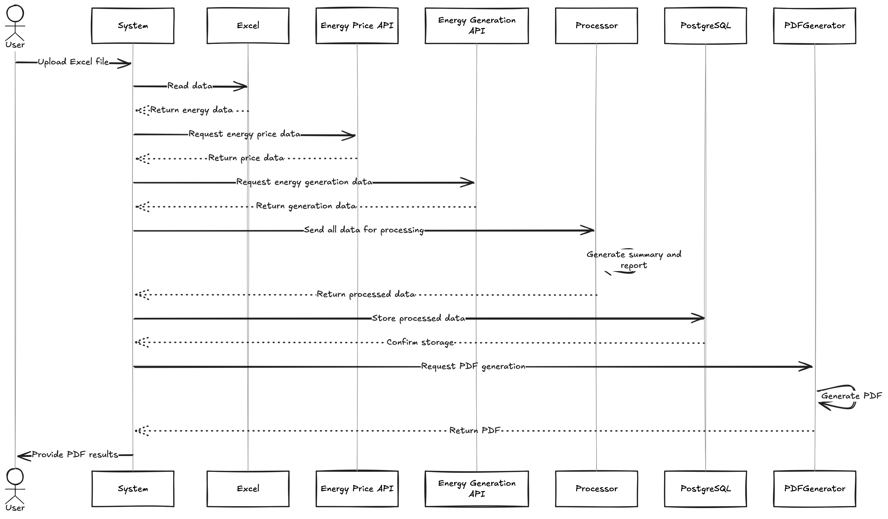

# Energía en Balance: La Lucha por la Precisión en la Industria Eléctrica

La industria eléctrica enfrenta un desafío diario: garantizar un suministro eficiente y preciso de energía, minimizando desperdicios y evitando sanciones costosas. Este informe analiza la problemática que enfrenta Juan, un analista de mercados de energía, cuya responsabilidad incluye la planeación, consolidación y generación de reportes energéticos diarios. El objetivo es presentar una solución que automatice y optimice sus procesos, reduciendo su carga laboral y minimizando errores.

---

## Índice

1. [Descripción](#descripción)
2. [Características principales](#características-principales)
3. [Tecnologías utilizadas](#tecnologías-utilizadas)
4. [Ejecución del Proyecto](#ejecución-del-proyecto)
   1. [Ejecución Manual](#ejecución-manual)
      1. [Crear un entorno virtual](#crear-un-entorno-virtual)
      2. [Activar el entorno virtual](#activa-el-entorno-virtual)
      3. [Instalar las dependencias](#instala-las-dependencias)
      4. [Configuración de Variables de Entorno](#configuración-de-variables-de-entorno)
      5. [Iniciar el Servidor](#iniciar-el-servidor)
      6. [Usar Swagger UI](#usar-swagger-ui)
   2. [Ejecución con Docker](#ejecución-con-docker)
      1. [Configuración de Docker](#configuración-de-docker)
      2. [Construir e iniciar los contenedores](#construir-e-iniciar-los-contenedores)
      3. [Verificar que los contenedores estén corriendo](#verificar-que-los-contenedores-estén-corriendo)
      4. [Acceder a la API](#acceder-a-la-api)
5. [Base de Datos](#base-de-datos)
6. [¿Cómo Funciona el Proyecto?](#cómo-funciona-el-proyecto)

---

## Descripción

Este es un proyecto basado en FastAPI que permite generar reportes de energía diaria. Los datos de energía se obtienen a través de peticiones a APIs externas y se analizan junto con un archivo Excel que es cargado por el usuario. Los resultados se almacenan en una base de datos PostgreSQL y se genera un informe en formato PDF.

---

### Características principales

- Carga de archivos Excel para análisis de datos.
- Obtención de datos de energía y precios a través de APIs externas.
- Almacenamiento de los resultados en una base de datos PostgreSQL.
- Generación automática de reportes en formato PDF.

---

### Tecnologías utilizadas

- FastAPI: Framework para crear la API de manera rápida y eficiente.
- PostgreSQL: Base de datos relacional para almacenar los datos.
- Pandas: Biblioteca para el análisis de datos, utilizada para procesar el archivo Excel.
- psycopg2: Adaptador de PostgreSQL para Python.
- FPDF: Biblioteca para la creación de documentos PDF.

---

### Ejecución del Proyecto

#### Ejecución Manual

Crear un entorno virtual

```bash
python3 -m venv env
```

Activa el entorno virtual:

En macOS/Linux:

```bash
source env/bin/activate
```

En Windows:

```bash
    env\Scripts\activate
```

Instala las dependencias:

```bash
    pip install -r requirements.txt
```

Configuración de Variables de Entorno

Crea un archivo .env en la raíz del proyecto completando las variables mostradas en

```
.env.sample
```

---

####  Iniciar el Servidor

Para iniciar la API, ejecuta:

```bash
    uvicorn app:app --reload
```

La API estará disponible en http://localhost:8000.

---

##### Usar Swagger UI

Una vez que el servidor esté en ejecución, puedes acceder a la documentación interactiva de Swagger en:

http://localhost:8000/docs

Desde allí, podrás probar el endpoint POST /generate-report/ cargando un archivo Excel y generando un reporte.

---

### Ejecución con Docer

Configuración de Docker

Asegúrate de tener Docker y Docker Compose instalados en tu sistema.

Crea el archivo .env con las mismas variables de entorno que se describen en la ejecución manual.

Construir e iniciar los contenedores:

    docker-compose up --build

Verificar que los contenedores estén corriendo:

    docker-compose ps

Acceder a la API

Una vez que los contenedores estén en ejecución, accede a la API en:

http://localhost:8000

Y la documentación de Swagger estará disponible en:

http://localhost:8000/docs

---

### Base de Datos

El proyecto usa PostgreSQL para almacenar los resultados de los reportes generados. Asegúrate de que la base de datos esté configurada correctamente, ya sea en el contenedor de Docker o de manera local.

Base de Datos PostgreSQL: Usa las credenciales definidas en el archivo .env.
Tabla de reportes: Al ejecutar la aplicación, se asegura de que la tabla reports esté disponible para guardar los datos.

```sql
CREATE TABLE reports (
id SERIAL PRIMARY KEY,
total_rows INTEGER,
total_columns INTEGER,
column_summary TEXT,
created_at TIMESTAMP DEFAULT CURRENT_TIMESTAMP
);
```

---

### ¿Cómo Funciona el Proyecto?

- Carga del archivo Excel: El usuario carga un archivo Excel con datos energéticos.
- Obtención de datos externos: El sistema obtiene información adicional de dos APIs externas (una para el precio de energía y otra para la generación de energía).
- Procesamiento de datos: Los datos del Excel y las respuestas de las APIs se procesan y se generan un resumen y un reporte.
- Almacenamiento en PostgreSQL: Los datos procesados se guardan en una base de datos PostgreSQL.
- Generación de PDF: Se genera un archivo PDF con los resultados y se proporciona al usuario.



---

## Stay in touch

- Autor - [Roso Peñaranda](https://github.com/RosoPenaranda/)

## License

All Right Reserved
